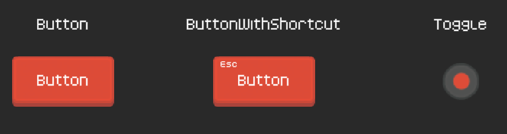

# Listonos Unity Packages
Small and personal Unity packages for kickstarting Unity 2D projects.

## Packages

### UI

Drop-in UI elements prefabs that use excelent [Kenney Assets](https://www.kenney.nl/assets) sprites and fonts. Some of them also wrap the Unity UI scripts with additional functionality. In this package is included a tiny generic navigation system that allows to enable or disable hierarchy of UI objects based on user defined enum type.

## How to Install

Simply clone or download the repo and then follow the ['Installing a package from a local folder' Unity Manual page](https://docs.unity3d.com/Manual/upm-ui-local.html).