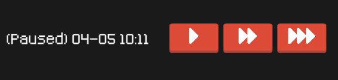

# Listonos' Unity Packages
Small and personal Unity packages for kickstarting Unity 2D projects.

## Packages

### UI

Drop-in UI elements prefabs that use excellent [Kenney Assets](https://www.kenney.nl/assets) sprites and fonts. Some of them also wrap the Unity UI scripts with additional functionality.

This package includes a tiny generic navigation system that allows to enable or disable hierarchy of UI objects based on user defined enum type.

See [the package docs](com.listonos.ui/Documentation/ListonosUI.md) for more information.

### Audio System

Wrapper around Unity's Audio Sources that comes with two pre-set channels and adds additional functionality such as queueing up audio clips.

See [the package docs](com.listonos.audiosystem/Documentation/ListonosAudioSystem.md) for more information.

### Time System

Real-world time simulation system for grand strategy style games with built-in UI elements for displaying and controlling it.

See [the package docs](com.listonos.timesystem/Documentation/ListonosTimeSystem.md) for more information.

### Jam Menu

Scaffolding for game dev jam projects that gives you Main Menu, Options and Credits screens, all set-up in a minute. It can optionally use Listonos' Audio System and support manipulating the Audio System in the Options screen.

See [the package docs](com.listonos.jammenu/Documentation/ListonosJamMenu.md) for more information.

Main Menu:

Credits:

### Ultimate CRT Extensions

Tiny script that extends [Ultimate CRT package](https://assetstore.unity.com/packages/vfx/shaders/fullscreen-camera-effects/ultimate-crt-80048) to supports outputting Ultimate CRT effects to render texture. Note that the `Ultimate CRT` package is not part of this package and it must be bought from Assert Store and imported into a project for this package to work.

## How to Install

Simply clone or download the repo and then follow the ['Installing a package from a local folder' Unity Manual page](https://docs.unity3d.com/Manual/upm-ui-local.html).