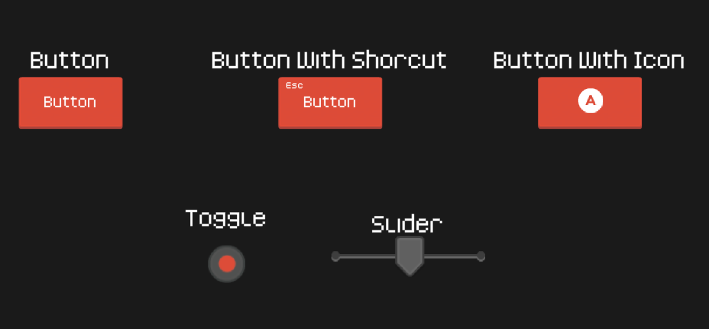

# Listonos Unity Packages
Small and personal Unity packages for kickstarting Unity 2D projects.

## Packages

### UI

Drop-in UI elements prefabs that use excelent [Kenney Assets](https://www.kenney.nl/assets) sprites and fonts. Some of them also wrap the Unity UI scripts with additional functionality. Additionally, this package includes a tiny generic navigation system that allows to enable or disable hierarchy of UI objects based on user defined enum type.

### Audio System

Small wrapper around Unity's Audio Sources that comes with two pre-set channels and adds additional functionality such as queueing up audio clips.

### Jam Menu

Scaffolding for game dev jam projects that gives you Main Menu, Options and Credits screens, all set-up in a couple of minutes. It can optionally use Listonos' Audio System and support manipulating the Audio System in the Options screen.

Main Menu:

Credits:

## How to Install

Simply clone or download the repo and then follow the ['Installing a package from a local folder' Unity Manual page](https://docs.unity3d.com/Manual/upm-ui-local.html).